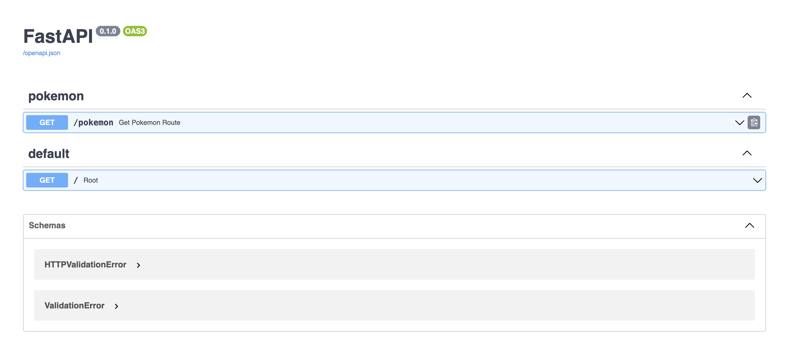
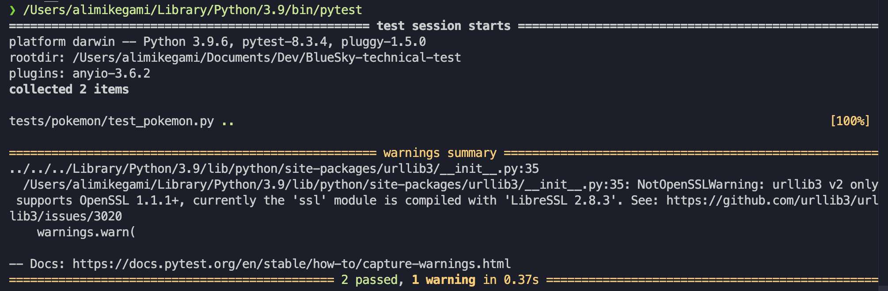

# BlueSky Back-end Engineer Technical Test
## Pokemon Data
The pokemon data is retrieved from <a href="https://pokemondb.net/">pokemondb.net</a>. The reasoning behind this is that the moderator in the site recently allows web scraping in moderation as stated in this <a href="https://pokemondb.net/pokebase/meta/82871/can-i-use-pokemons-data-of-this-website-for-my-school-project">reference</a>. Here are the Pokemon data fields stored in this project:
- Name
- Type 1
- Type 2
- Pokedex ID
## Running The Project
To run the project as a container, use the following command:
```
docker compose up -d
```
Once executed, the API will be accessible at `http://localhost:8001`
## Tech Stacks
The following technologies are used in this project:
- Python (BeautifulSoup4, FastAPI, MySQL connector, dotenv, pytest)
- MySQL
- Docker
## Project Structure
For this project, I'm using <a href="https://github.com/zhanymkanov/fastapi-best-practices#1-project-structure-consistent--predictable">this</a> project structure.
```
.
├── Dockerfile
├── README.md
├── docker-compose.yml
├── requirements.txt
├── screenshots
│   ├── api_docs.png
│   └── test.png
├── src
│   ├── __init__.py
│   ├── database.py
│   ├── main.py
│   └── pokemon
│       ├── __init__.py
│       ├── repository.py
│       ├── route.py
│       ├── schemas.py
│       └── service.py
└── tests
    ├── __init__.py
    └── pokemon
        ├── __init__.py
        └── test_pokemon.py
```
The repository file contains the database interaction. The service file contains the business logic. While the router files handle the routing of the API.
## API Documentation
The API documentation can be accessed at `http://localhost:8001/docs`


## How The Project Works
This project scrapes data from <a href="https://pokemondb.net/">pokemondb.net</a> using BeautifulSoup4. The scraping process serves as a database seeding mechanism for the API, which then serves Pokemon data from the local database.
## Tests
### Integration Tests
The integration test written for this project can be found in `tests` directory. I have tested two cases for the get Pokemon endpoint:
1. Successful retrieval of Pokemon data
2. Empty records response when filtering by a non-existent Pokemon type

To run the test, use the following command:
```
pytest
```

